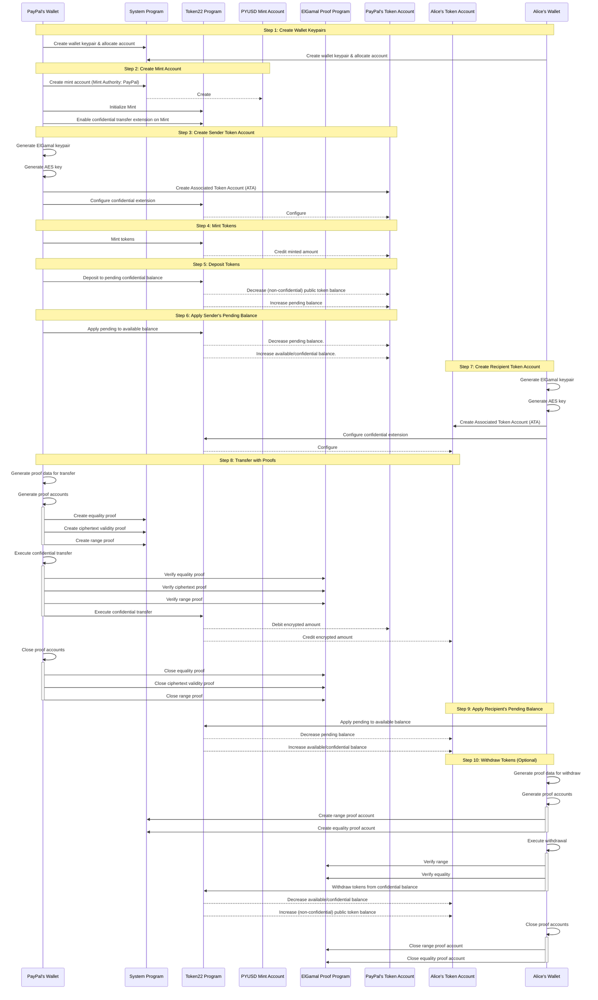

# Open Questions
- How does a new global auditor decrypt confidential transfers from prior global auditor's key?
  - We should define expectations for auditor transference.

# Confidential Transfers Cookbook

A collection of ingredients (tests) and recipes (test sequences) demonstrating Solana transfer patterns.

## Test Commands

### Running Individual Ingredients

```bash
# Run all tests in an ingredient
cargo test -p setup_participants

# Run a specific test from an ingredient
cargo test -p setup_participants setup_basic_participants
```

### Running Recipes (Test Sequences)

```bash
# Run all recipes
cargo test -p test-runner

# Run a specific recipe
cargo test -p test-runner recipe::basic_transfer_recipe
```

### Test Output Options

```bash
# Show output from successful tests
cargo test -- --nocapture

# Show test execution time
cargo test -- --show-output

# Run tests in single thread (default is parallel)
cargo test -- --test-threads=1
```

## Project Structure

```
.
├── ingredients/           # Individual test modules
│   └── setup_participants/
├── recipes/              # Complex flows combining ingredients
│   └── transfer_public_mint/
├── test-runner/         # Test sequencer for recipes
└── utils/              # Shared utilities
```

Each ingredient is a standalone test demonstrating a specific Solana functionality.
Recipes combine these ingredients in specific sequences to demonstrate more complex flows. 


# Confidential Transfer Example
This is an isolated basic example of the confidential transfer flow found in [Token Program CLI](https://github.com/solana-labs/solana-program-library/tree/master/token/cli).
Use this as a guide to implement confidential transfer in your own applications.
While the API is still work in progress, the instructions flow should be mostly stable.

# Setup
At the time of writing, SPL repo contains an undeployed version of Token22 with active developments on confidential transfer extension. To run the sample, and the known [CLI example](https://github.com/solana-labs/solana-program-library/blob/d9a6ee8db65167098b654b300ac23abc08fd8a7d/token/cli/examples/confidential-transfer.sh#L1), you will need to [build the Token22 program from source and deploy it on the solana-test-validator](https://solana.stackexchange.com/questions/10062/errors-when-trying-out-confidential-transfer-token-extension-on-solana-test-vali).

## Version Requirements
- `solana-test-validator` v2.0.1
- `cargo-build-sbf` v0.2.0

## Validator Setup

1. `git clone https://github.com/solana-labs/solana-program-library.git`  

1. `cd solana-program-library`

1. `git checkout d2f5144c1650179376cb0e2fad6aa656ffd5749a` (known working version)

1. `cd token/program-2022`

1. `cargo build-sbf --tools-version v1.43`

1. `solana-test-validator -r --bpf-program TokenzQdBNbLqP5VEhdkAS6EPFLC1PHnBqCXEpPxuEb ../../target/deploy/spl_token_2022.so`

## Run the sample

1. `cargo run --bin main`

# Flow
This is a high-level overview of how confidential transfers interact with the different programs and accounts. The following depicts PayPal confidentially sending net-new PYUSD to Alice:

