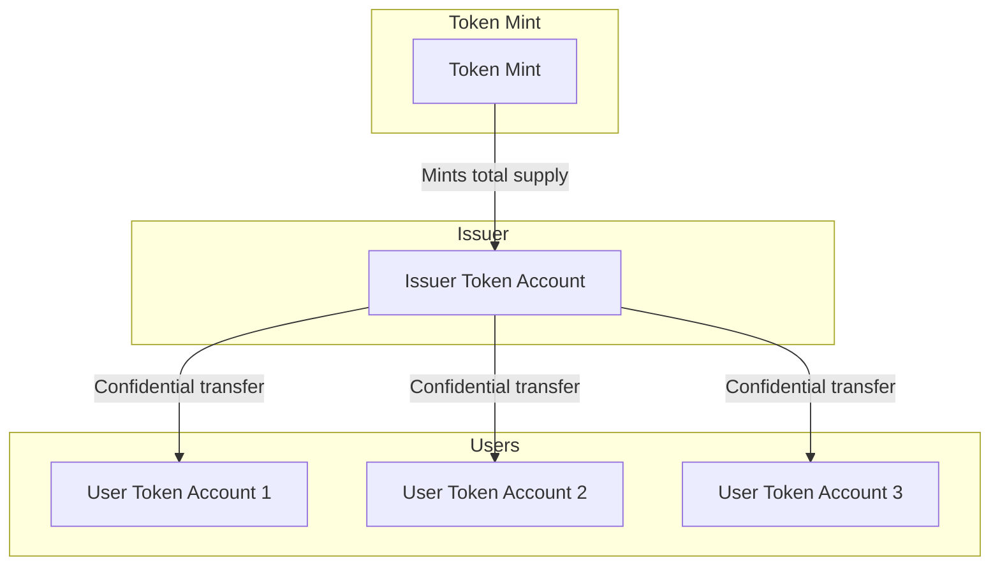

# FAQ

## Can an initialized mint retroactively add confidential transfers extension?
No. However, there is an alternative: [token wrap program](https://github.com/solana-program/token-wrap). It's important to understand that pursuing token wrapping indirectly fragments liquidity since the Solana ecosystem (DeFi, dApps, etc.) recognizes the wrapped token as a separate token mint. Plan judiciously.

## How to confidentialize a Confidential Transfers mint extension without also adding the Confidential MintBurn extension?

This is a creative operational solution: instead of minting on-demand, the issuer maintains a treasury account with the total supply. While the total supply remains public, individual transfer amounts stay confidential by originating all transfers from the issuer's account. The issuer pre-mints the total supply, then confidentially transfers partial amounts to recipients, creating a quasi-mint-burn mechanism.

## What is the minimum number of CU's, accounts, and transactions needed to make a Confidential Transfer?
Compute Unit (CU) usage depends on implementation details. For example, storing zk proofs in context state accounts (as primarily exemplified in this repository) versus being part of the confidential transfer instruction data.

Below are mainnet examples for Confidential Balances, along with their respective CU usage.

|Operation|Compute Units|Example|
|---|---|---|
|Realloc|6,155| [Solscan](https://solscan.io/tx/4NaK8Br354eWXXoQUoD9qQbWJeWmEkZT8uUND1sqnZixoV9bvxJ1p6E1fUkRcx64Yh7rZNmba1Tyeb9cxXdSY9gr)|
|Configure|4,121| [Solscan](https://solscan.io/tx/5p82KLSCo89Gwx2CmNpGwB73S8QCaUBnRh1N3xAQSt55aJbEnWK7e86EaCzXAqFNVRRCNf1geoB5mq4JuNwFDRXQ)|
|Deposit|14,526| [Solscan](https://solscan.io/tx/2Hvb1hJDt5qeYuUMWmgMGCinvW6TkVixRZgNLGyPTnfRDkyBuFK5NJLzi5KkWxh9NCK7hoBpbawnK9xaUX2AArRZ)
|Apply|16,748| [Solscan](https://solscan.io/tx/4riLZhKNkwgcypQ9gQ15go4jgnDGGX4PCuNSKNDpb8Motj9XNx9eiBYPdL5PvaYKncQbEGnctEa7NAKARMDQtGzQ)
|Withdraw|9,958| [Solscan](https://solscan.io/tx/2YpFD8Fz5QJKCt7qrcrCxwm66NWU1qPzhps1QKWkGeUnmCJzBXQ4Dpkvj8fnvG6Ag86ieShqKsk14PJ4BhkNnZ2R)
