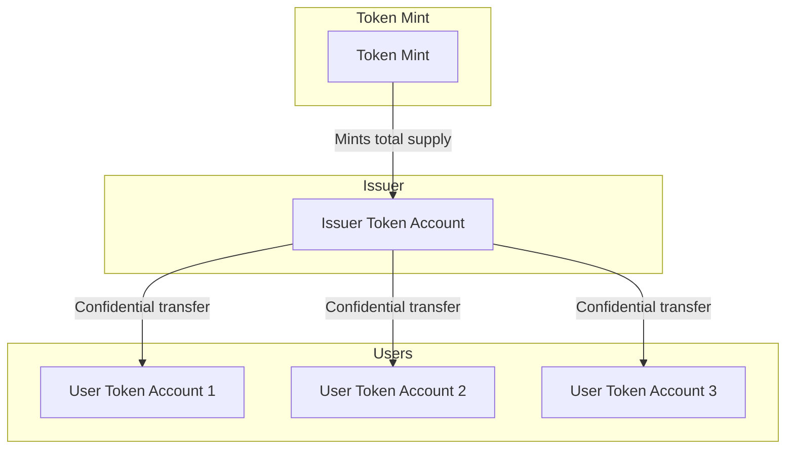

# FAQ

## Can an initialized mint retroactively add confidential transfers extension?
No. However, there is an alternative: [token wrap program](https://github.com/solana-program/token-wrap). It's important to understand that pursuing token wrapping indirectly fragments liquidity since the Solana ecosystem (DeFi, dApps, etc.) recognizes the wrapped token as a separate token mint. Plan judiciously.

## How to confidentialize a Confidential Transfers mint extension without also adding the Confidential MintBurn extension?

This is a creative operational solution: instead of minting on-demand, the issuer maintains a treasury account with the total supply. While the total supply remains public, individual transfer amounts stay confidential by originating all transfers from the issuer's account. The issuer pre-mints the total supply, then confidentially transfers partial amounts to recipients, creating a quasi-mint-burn mechanism.

## What is the minimum number of CU's, accounts, and transactions needed to make a Confidential Transfer?
It depends on the the UX flow most relevant to the application. (Todo: point toward the most compact recipe)