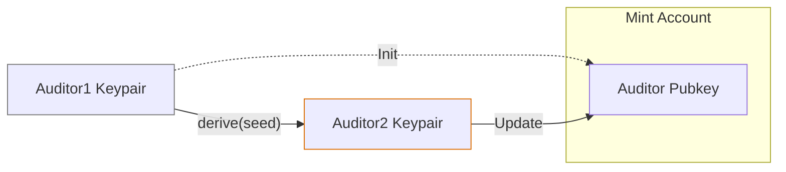
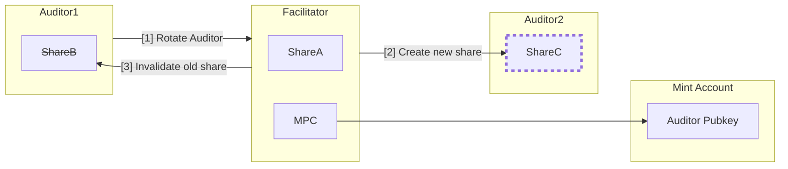
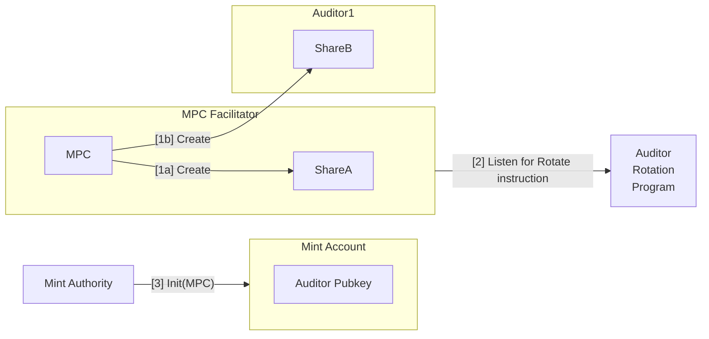
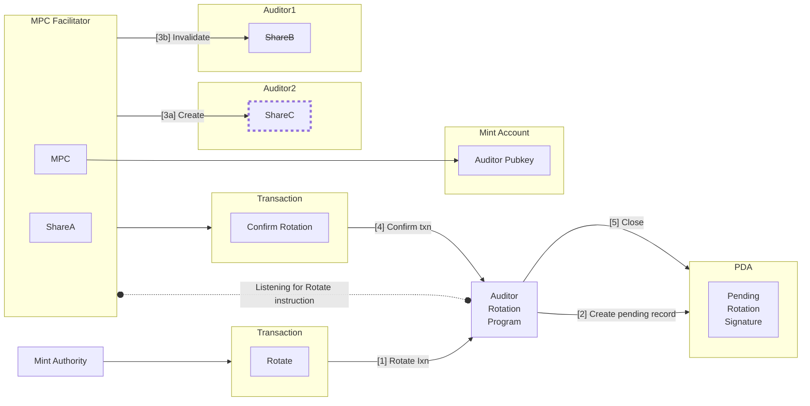

# Auditor Rotation

Auditor rotation is the process of changing the global auditor of a token.
Rotation capabilities depend on the chosen solution:

## On-chain with Key Derivation
Steps:
1. Mint account is initialized with an auditor keypair.
1. Auditor1 sends a copy of auditor keypair to Auditor2.
1. Auditor2 derives a new keypair from the original.
1. Mint authority updates the mint account with Auditor2's pubkey.

Limitations:
- Cannot revoke Auditor1 access. Auditor1 keeps a copy of the keypair.
- Compromised keypair irrevocably exposes associated confidential transfers.
- Auditor1 knows the original seed, they can brute force Auditor2's derivation seed.
- Every auditor rotation increments the total derivations to track.
  - This is a problem for frequently rotating auditor sets.
  - Requires separate tooling for associating transfers with the corresponding derivation.
  

## Off-chain MPC
1. MPC is initialized with 2-of-2 quorum:
    - ShareA: MPC facilitator service (neutral party).
    - ShareB: Auditor1.
1. Mint account is initialized with MPC public key as auditor pubkey.
1. Auditor1 invokes MPC reshare to add Auditor2 to the MPC.
  1. MPC facilitator service gathers ShareA and ShareB.
  1. MPC facilitator service generates ShareC for Auditor2.
  1. MPC facilitator service invalidates ShareB.

Benefits:
- Enables auditor revocation.
- Allows for multiple simultaneous auditors.
- Mitigates risk of compromised auditor key.
- Keeps a consistent auditor keypair regardless of the auditor set.
- Cost-effective for frequent auditor rotations.

Limitations:
- Cannot compartmentalize auditor access to a subset of confidential transfers.
- Requires third-party MPC facilitator service.
- Lacks verifiability
    - Can't tell when a new auditor is added to the MPC.
    - Can't identify an individual auditor's key.
- Trusted setup is required for MPC.

## Hybrid MPC
Assumes deployment of an "Auditor Rotation Program" (ARP)
### Setup
1. MPC is initialized with 2-of-2 quorum:
    - ShareA: MPC facilitator service (neutral party).
    - ShareB: Auditor1.
1. MPC facilitator service listens for transactions to ARP.
1. Mint account is initialized with MPC public key as auditor pubkey.

### Rotation
1. Mint authority sends Rotate Auditor instruction to ARP.
    - Contains new Auditor2's MPC ID.
1. ARP generates a Pending Rotation PDA.
1. MPC facilitator reacts to ARP transaction.
    1. MPC facilitator gathers ShareA and ShareB.
    1. MPC facilitator generates ShareC for Auditor2.
    1. MPC facilitator invalidates ShareB.
1. MPC facilitator submits a "Confirm Rotation" transaction to ARP.
    1. ARP verifies confirmation is valid.
    1. ARP closes the Pending Rotation PDA.

## Custodial
This is a solution with an opaque custodian.
The custodian is trusted to:
- Update mint account with new auditor keypair.
- Facilitate providing correct decrpytion keypair for each auditor era.
- Provide authentication mechanism for each auditor.
- Determine how to custody the underlying keypair.

There are many ways to implement this solution.
It's up to the custodian to determine the best approach.