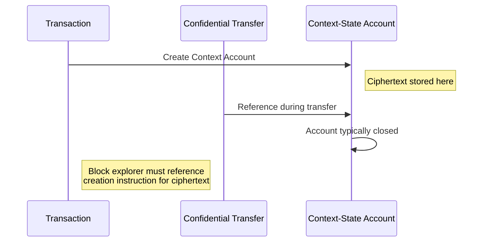
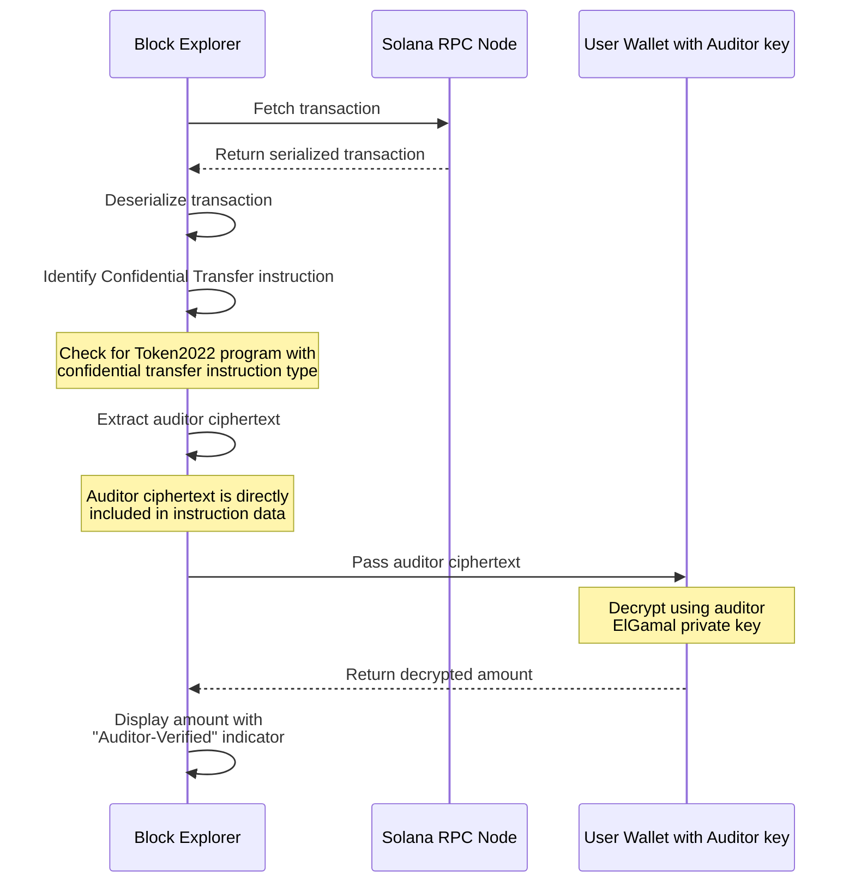
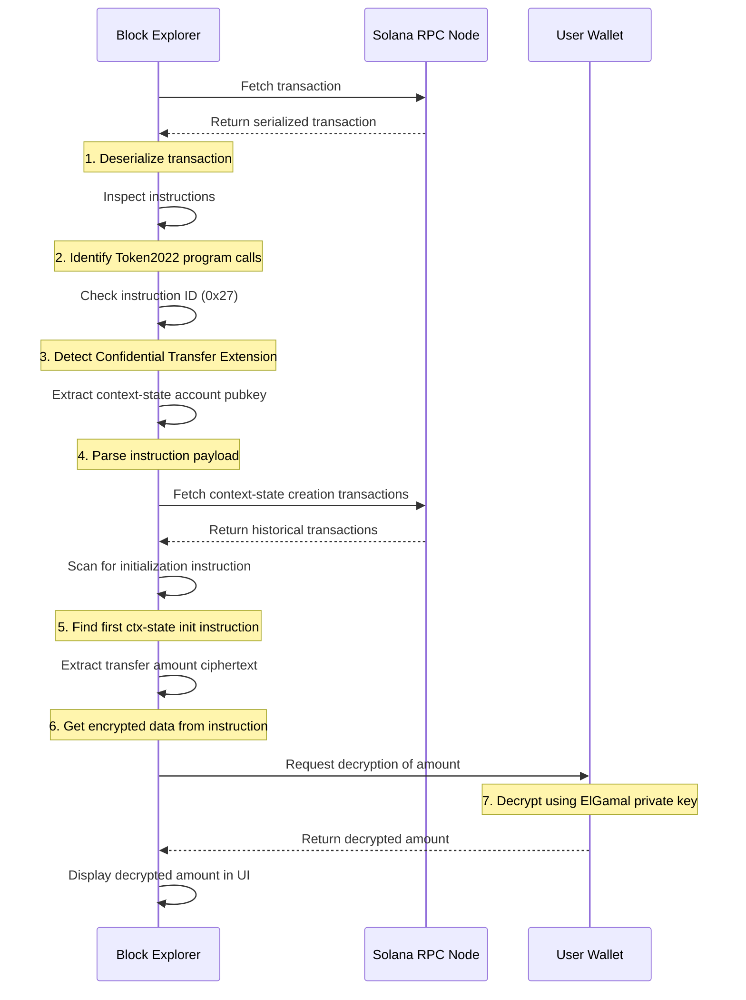

# Block Explorer Integration Guide

## Overview

Block explorers play a critical role in the Solana ecosystem by providing transparency and visibility into on-chain activity. When supporting Confidential Balances, explorers face unique challenges related to encrypted data and specialized instruction handling.

This guide outlines best practices for integrating Confidential Balances support into block explorers.

## Understanding Confidential Transactions

Solana has no inherent "confidential transaction" primitive. Instead, confidentiality exists at the instruction level through the Token2022 program. When working with confidential transfers:

1. Token amounts are encrypted using homomorphic encryption (ElGamal)
2. Zero-knowledge proofs validate transaction integrity without revealing amounts
3. Special ciphertexts may be included for auditor access

Block explorers must detect and properly display these specialized instructions to provide accurate transaction information.

## Fundamental Constraints

Block explorers operating securely lack access to user encryption keys, preventing automatic decryption of confidential balances. Instead, explorers must:

- Identify and clearly display confidential transfer instructions
- Implement wallet connection interfaces to request decryption when needed
- Support specialized UI components for encrypted balances
- Maintain clear distinction between encrypted and plaintext data

## Detecting Confidential Instructions

To properly identify confidential operations, block explorers need to:

1. Identify Token2022 program invocations (program ID)
2. Parse instruction data to detect confidential transfer operations (instruction ID 0x27)
3. Examine inner instruction types for specific confidential operations
4. Handle the specialized serialization format of encrypted data

```typescript
// Example detection logic
function isConfidentialTransferInstruction(instruction) {
  return instruction.programId.equals(TOKEN_2022_PROGRAM_ID) && 
         instruction.data[0] === 0x27; // ConfidentialTransferExtension
}
```

## Context-State Account Handling

Context-state accounts are temporary accounts created during confidential transfer operations to store zero-knowledge proofs. These accounts are essential for validating the integrity of confidential transfers without revealing the actual amounts.

For operations like withdrawals, two types of proofs are typically required:
1. **Equality proofs** - Verify that the amount being withdrawn matches the encrypted balance
2. **Range proofs** - Ensure the withdrawal amount is within valid bounds (non-negative)

Each proof requires its own context-state account, which stores the cryptographic proof data needed for on-chain verification. These accounts are typically created just before the operation and closed immediately after to reclaim rent, making them transient in nature.

When using context-state accounts for confidential transfers:

1. Sender/receiver ciphertexts are stored in separate context-state accounts
2. These accounts are typically closed after transfer completion
3. Block explorers must:
   - Identify the context account creation instruction in transaction history
   - Extract ciphertext from the instruction payload
   - Maintain references even after account closure



## Displaying Confidential Transfers

Block explorers should implement specialized UI elements for confidential transactions, clearly indicating when amounts are encrypted. There are two primary approaches to decryption:

### Auditor Decryption

Auditors have a more straightforward path to decrypt confidential transfers thanks to dedicated ciphertext included in the transfer instructions.



### Sender/Receiver Decryption

For users to decrypt their own transaction amounts, the process is more complex and requires wallet integration:



## UI/UX Best Practices

Block explorers should implement these UI/UX best practices for confidential transactions:

- Clearly distinguish encrypted balances from plaintext ones
- Provide informative tooltips explaining confidentiality mechanics
- Display encryption status indicators (locked/unlocked icons)
- Support optional balance revelation with appropriate warnings
- Maintain visual consistency with conventional transaction displays

## External Integration Recommendations

Block explorers without native wallet integration capabilities should:

1. Clearly identify confidential transactions/instructions
2. Provide links to specialized dApps like @microsite_main
3. Implement deep linking to pass transaction context
4. Support QR code generation for mobile workflows

## Implementation Checklist

- [ ] Detect and parse Token2022 confidential instructions
- [ ] Implement wallet connection for decryption requests
- [ ] Add UI components for encrypted balance display
- [ ] Support context-state account tracing 
- [ ] Add integration with specialized confidential dApps
- [ ] Provide educational content about confidential balances

## Additional Resources

- [Confidential Balances Product Guide](product_guide.md)
- [Wallet Integration Guide](wallet_guide.md)
- [Protocol Deep Dive](https://www.solana-program.com/docs/confidential-balances/overview)

