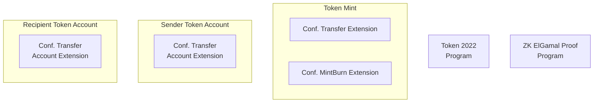
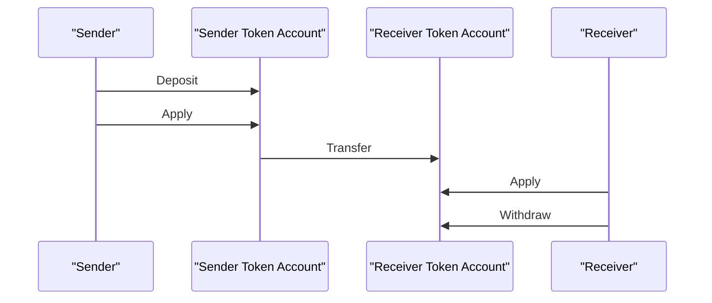

# Confidential Balances Product Guide

## Introduction
Confidential Balances is a set of Token2022 extensions that enable privacy on Solana asset transfers. The set of extensions is comprised of:
- [Confidential Transfer](https://github.com/solana-program/token-2022/tree/main/program/src/extension/confidential_transfer)
- [Confidential Transfer Fee](https://github.com/solana-program/token-2022/tree/main/program/src/extension/confidential_transfer_fee)
- [Confidential MintBurn](https://github.com/solana-program/token-2022/tree/main/program/src/extension/confidential_mint_burn)
  - [Motivation](https://github.com/solana-labs/solana-program-library/issues/6879)

Instead of an all-or-nothing approach, these token extensions allow varying degrees of configurable privacy. You can transfer tokens with increasing levels of confidentiality:
1. Disabled confidentiality.
1. Whitelisted confidentiality.
1. Opt-in confidentiality.
1. Confidentiality by default with opt-out options.
1. Required confidentiality.

Confidentiality is achieved with use of serveral encryption techniques on token balances:
- Homomorphic encryption to enable arithmetic operations on encrypted data.
- Advanced encryption standards (AES) to encrypt the balance and transfer amounts.
- Zero-knowledge proofs (ZKPs) to ensure integrity of encrypted balance changes without revealing the amount.

Confidential Balances have compliance baked in. Token issuers can optionally assign global auditors for regulated jurisdictions. Auditors have the ability to decrypt account balances and transfer amounts for KYC, AML, and other compliance purposes.

To develop a technical intuition for Confidential Balances, see the [Protocol Overview](https://spl.solana.com/confidential-token/deep-dive/overview).

## Getting Started
Confidential Balances require several Solana primitives illustrated below:

- The token mint must be created with Token2022 to support extensions.
- Token accounts must also initialize a confidential transfer extension.
- ElGamal Proof program is used to generate & verify ZKP's.

Developers interfacing with Confidential Balances need to set up a typical [Solana development environment](https://solana.com/docs/intro/installation#install-dependencies), or at the bare minimum, the latest version of the [Solana CLI](https://solana.com/docs/intro/installation#install-the-solana-cli).

## Try It Out
There are two ways to try your first confidential transfer:
- Beginner: [Token CLI Quickstart Guide](https://spl.solana.com/confidential-token/quickstart)
    - Minimum requirements:
        - solana-cli 2.1.13 (src:67412607; feat:1725507508, client:Agave)
        - spl-token-cli 5.1.0
    - Provides all basic functionality to operate a confidential token.
    - Fixed set of operations from the CLI menu.
    - Use [this provided shell script](https://github.com/solana-program/token-2022/blob/main/clients/cli/examples/confidential-transfer.sh) to execute an end-to-end confidential transfer.

- Intermediate: [Cookbook Basic Transfer Example Recipe](recipes.md#L12)
    - Requires the Solana development environment installation.
    - Includes examples of signing transactions & encryptions with [Turnkey](https://www.turnkey.com/) and [Google KMS](https://cloud.google.com/security/products/security-key-management?hl=en).
    - Extended set of operations from the CLI menu with easy tweaking and experimentation.

Regardless of method you will find yourself conducting the same key operations:

- Deposit:
    - Confidentializes a token account's balance by storing the amount in an encrypted form.
    - Deposit amount is set to a pending state.
    - This operation is disabled if using MintBurn extension.
- Withdraw:
    - Removes amount from available confidential balance.
    - Withdraw amount is set to a pending state.
    - This operation is disabled if using MintBurn extension.
- Transfer:
    - Deducts the sender's available confidential balance.
    - Credits the recipient's pending balance.
- Apply:
    - Reconciles all pending amounts to credit/debit public token balance & available confidential balance.

Read more about [pending & available balances](https://www.solana-program.com/docs/confidential-balances/encryption#account-state).

## Specialized Guides
- [Block Explorers](block_explorers.md)
- [Wallets](wallet_guide.md)
