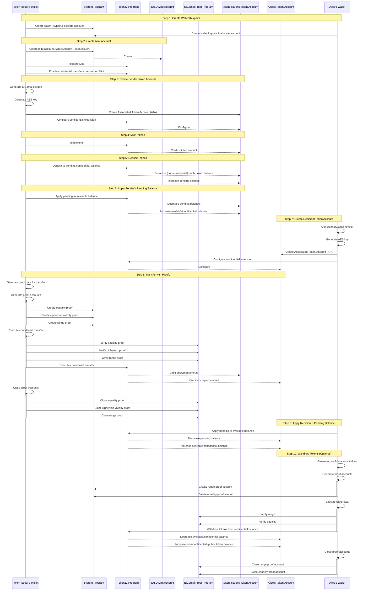
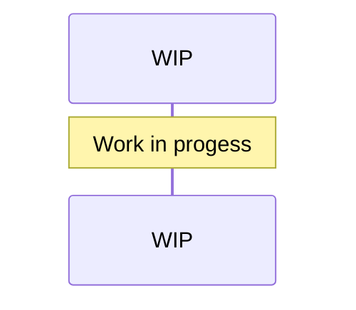

# Recipes

## Table of Contents
- [Basic Transfer](#basic-transfer)
- [Confidential MintBurn Transfer](#confidential-mintburn-transfer)

## [Basic Transfer](../recipes/src/lib.rs#L43)
### Scenario:
- Public mint account (without confidential mint/burn extension).  
- Alice makes an offchain request to the Token Issuer (mint authority) for confidentially redeeming cUSD stablecoins. 
- Token Issuer delivers funds to Alice's token account as confidential transfer.

### Notes:
- The mint account mints/burns publicly, and requires Deposit & Apply instructions prior to Confidential Transfer.
    - The Token Issuer must have their own token account to receive the minted tokens.
- Due to public mint/burn, the transfer is only partially confidential.

## [Confidential MintBurn Transfer](../recipes/src/lib.rs#L18)
Scenario:
- Confidential mint account (using confidential mint/burn extension).  
