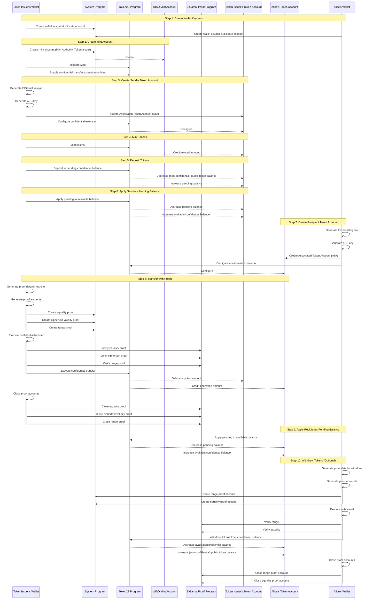
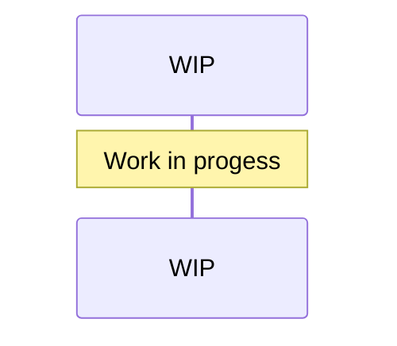

# Recipes

## Table of Contents
- [Basic Transfer](#basic-transfer)
    - [Sample transactions on Devnet](#sample-transactions-on-devnet)
- [Confidential MintBurn Transfer](#confidential-mintburn-transfer)


## [Basic Transfer](../recipes/src/lib.rs#L43)
### Command:
```bash
cargo test --package recipes --lib -- --nocapture recipe::basic_transfer_recipe --exact --show-output
```
### Scenario:
- Public mint account (without confidential mint/burn extension).  
- Alice makes an offchain request to the Token Issuer (mint authority) for confidentially redeeming cUSD stablecoins. 
- Token Issuer delivers funds to Alice's token account as confidential transfer.

### Notes:
- The mint account mints/burns publicly, and requires Deposit & Apply instructions prior to Confidential Transfer.
    - The Token Issuer must have their own token account to receive the minted tokens.
- Due to public mint/burn, the transfer is only partially confidential.
- Ideally, the tokens are minted directly into the recipient's token account, but we're doing the extra step to demonstrate the confidential transfer process.


### Sample transactions on Devnet:
Accounts:
- Sender account: `Gx6c2Nbbs5QpNMESyVGCarV4mRaaj2HMdmPWpqnJmiXq`
- Sender token account: `F9tQww2FjPNkeRsEYiRgRZL4fuZ8gSMkTvABWY95uGji`
- Recipient account: `5Co1gFfHZCvQuh4Axn7HGKQGzRAr8ADRUnFtJyvf84Fr`
- Recipient token account: `FfqTATdbRN3e1PegbbDQVj34gPyYcqaV1Jh2xpNYyJGa`
- Fee payer account: `HM7txdn2hDBeGDvuC2xfDdKL9XmUNuNvw6BbyXcZKtQD`
- Mint authority account: `GMh1zRFSJudft5uaQiEespzUNePYFL73PCgK5LQacRbK`
- Mint account: `GyRRg4bEhVN75JtoANe4vyEw2zpWYduuCGDxCEZu7KTe`

Transaction links per step (devnet):
1. Create Wallet Keypairs
    - [Fund Sender Account](https://explorer.solana.com/tx/chw4YusLfm3Kq778VJnRPWeGczbTA9HXeizbtPrwtJfSmd4qcGFXKntVTDHxkCkX8tkbHpLZffD24jy4XVuhgMB?cluster=devnet)

    - [Fund Recipient Account](https://explorer.solana.com/tx/5JDFa2SBKfUGrMreQDvvcKPFHyQepNKWW9dUMB2mYmvipKUJTo2K91YweQ5P9RAbSGghwZyoNiPJY2rDkfNQbAT2?cluster=devnet)

1. [Create Mint Account](https://explorer.solana.com/tx/4qAXna48cMC677F6ZjkKbsHETnNpDzX1FF8mFN1zi6LMBjszUjcUR19E8Ng1Uw68m7GLgHsnYVyJRZFPF4sFGXaW?cluster=devnet)

1. [Create Token Account](https://explorer.solana.com/tx/2wpnFHCLcFeNsEHcjF2P8Gj3dVsbct9RLupWLCZkN6TTXHgJQUdiYqu9hSzTcX1mtTK4AAPwaN4W1ZgcA6dX7aQT?cluster=devnet)

1. [Mint Tokens](https://explorer.solana.com/tx/4MJu5e2cFrws8ehYBU93PcqBhRVwr4o4pxFbNZcZg9XjLy86GyWX7g1C8kRVvPNtxYSwcrmuh6GTdU6BVoSq7jqj?cluster=devnet)

1. [Deposit Tokens](https://explorer.solana.com/tx/wJw7HhX1p737XNvVwJLEwE7oCDuSxyJYZPD7xJqLWL4ao3osJ7bdmUoy8R5pTtfL2EqPysr8v2wgJRNTMM9VHsM?cluster=devnet)

1. [Apply Pending Balance](https://explorer.solana.com/tx/6y1aNHz7NzVzbEXxf4Rw5xV1EZ8CWFx1zamL9N49YkdJ3JKRpMSLVqdSGfBobSbiAj5zuxfyibwTC1NXgKdjWco?cluster=devnet)

1. [Create Recipient Token Account](https://explorer.solana.com/tx/2VfuPxmm9JsZJB8DKpTCfDzAsigFaNdEuWPtNqyWSKAqbMJJqcy8jguHzPjLiSTJAJzX9sEGFeXN2fjMCqpRRkka?cluster=devnet)

1. Transfer

    - Create Range Proof Context State (too large for a single transaction)
        - [Allocate Context State Account](https://explorer.solana.com/tx/3i7Wmspx4MUyiNAjHuXxhiP773dLaTghnnCGZzwmih5zLMhRoUqwPHhhAK33w3TAEtgsLUCTrCvw9KXmohJkyUvg?cluster=devnet)
        - [Encode the proof ](https://explorer.solana.com/tx/3oQivHMnWAWFjFZcyn2gk8UhkQfzuDPb8hEg1h3xxLwPbyLMc1QNhBvfk6ozd4myPk2vxj1WTKXnHzgt47h2FxPL?cluster=devnet) 

    - [Create Equality Proof Context State](https://explorer.solana.com/tx/aPjBD7yuEPrRiyj8Ycu1jPFKrYgt3YBC5nk1JQxWenGydLHKcpwCvDzsqzMSMeoP5Y5YPkPebsPhUPCzi2SDHkv?cluster=devnet)

    - [Create Ciphertext Validity Proof Context State](https://explorer.solana.com/tx/5K3Du5EfX1pzcMBzdRNtcLXbQsikr2KDbAKVYgvrUwSh8WMkVsn4Jp4MCgFu7vW2SPqeKyLh3CXX8Jdx6pxoyt3d?cluster=devnet)

    - [Transfer with Split Proofs](https://explorer.solana.com/tx/2rhcbfkr64koHWjoHCJKjbxxS6TonbRH1KVQUvZSFJwM7vnz181eb4eqSkgo3aEFmbnZT5K4z124jW2rRXGuAYU2?cluster=devnet)

    - [Close Proof Accounts](https://explorer.solana.com/tx/5VuxBSS2e9uXqVSME3e9Ktg8ZsLH57y441obxF1s2SaFo8hs1tTgQxofWyw9VsGPPq8PGcMs8JFD3XhBg7p3Zph?cluster=devnet)

1. [Apply Pending Balance](https://explorer.solana.com/tx/86nZEeHGtc2jqLSFn6L8i5P3UyGdQCyt4V3WBF35HCEEbmCehpxErFA76X5ktjqk9h1aYsbCVASBX42fJZ3wkKR?cluster=devnet)

1. Withdraw
    - [Equality Proof Context State Account](https://explorer.solana.com/tx/3iZt3wwbjink4Xqaih5w1naUmbx2EjZ2M5KQJaygnCUNoPbtgzZVXXCggpEJaLiBRRegdSsyxK2drvCDpfM3QSFg?cluster=devnet)

    - [Range Proof Context State Account](https://explorer.solana.com/tx/3ewh5q4vJWJggjAvA1Sug6yaPMVAe4ePy3nBndYTVf7wchfbiMEeJxNQ6dvTxx1D1p9AZfxX4GuqwT9xGKRDr7DL?cluster=devnet)

    - [Withdraw Transaction](https://explorer.solana.com/tx/UDKGNqXuyWQGwvDPgzrEEwPZmGbyWcDiqxhcb97NHDXwMeZipUsCxFKzBWLZXvnvPDtAA9ZtAjNmYohkvVv2S4T?cluster=devnet)

    - [Close Equality Proof Context State Account](https://explorer.solana.com/tx/5uXMwYM7ykH9SM8EmVmv6h3ZDzvGgVwihYzUmnvV5BxCeoxA9QbWdQbK7nM7gfW2cRQ3iqJzZftniRshd5PL9JVZ?cluster=devnet)

    - [Close Range Proof Context State Account](https://explorer.solana.com/tx/128Yq7WSjejDg5vpGNL6VzJgKqG2o3trPFHiCjTfLEzRJ1j3jbWVQkv7msXDtBsDKHeTEpJF6zoiQMjzU3NwKPaZ?cluster=devnet)


## [Confidential MintBurn Transfer](../recipes/src/lib.rs#L18)
Scenario:
- Confidential mint account (using confidential mint/burn extension).  

