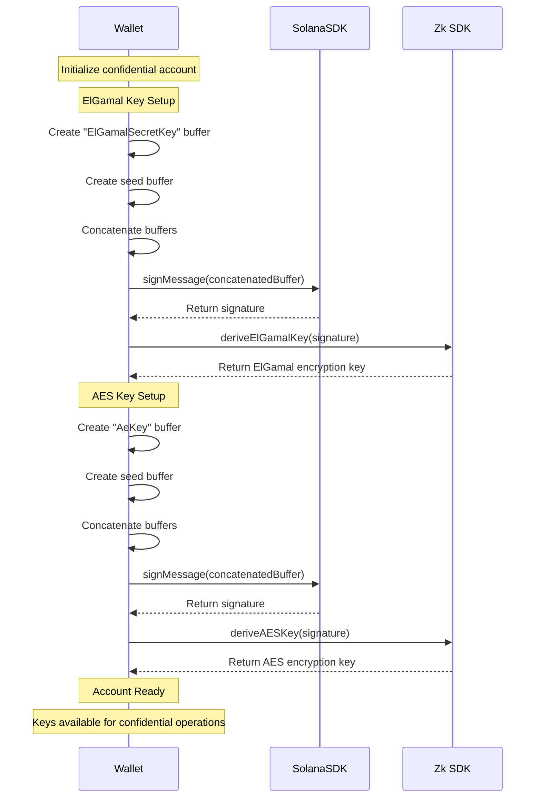

# Wallet Integration Guide

## [Setup](wallet_guide_setup.md)

## [Transfers](wallet_guide_transfers.md)

## [Checking Balances](wallet_guide_balances.md)

## Encryption Scheme

The confidential transfer system uses a dual-key encryption scheme based on ElGamal and AES encryption. The keys are derived from wallet signatures using specific seed messages.

### Key Derivation Process

1. **ElGamal Key Derivation**
   - Seed Message: `"ElGamalSecretKey"`
   - Purpose: Used for ElGamal encryption of confidential balances
   - Source: [Agave zk-sdk](https://github.com/anza-xyz/agave/blob/d58415068289a0e030d91d2bbb5680f752947ff6/zk-sdk/src/encryption/elgamal.rs#L516)

2. **AES Key Derivation**
   - Seed Message: `"AeKey"`
   - Purpose: Used for AES encryption of confidential data
   - Source: [Agave zk-sdk](https://github.com/anza-xyz/agave/blob/d58415068289a0e030d91d2bbb5680f752947ff6/zk-sdk/src/encryption/auth_encryption.rs#L136)

### Signature Generation

The key derivation process follows these steps:

1. The wallet signs a specific seed message concatenated with an empty public seed
2. The signature is used to derive the encryption keys
3. The empty public seed ensures compatibility with the SPL Token CLI implementation

```typescript
// Example of signature generation
const messageToSign = Buffer.concat([
  seedMessage,    // Either "ElGamalSecretKey" or "AeKey"
  emptyPublicSeed // Empty byte array for CLI compatibility
]);
```



### Security Considerations

1. **Hard-coded Seeds**
   - The seed messages are hard-coded to ensure consistent key derivation across all implementations
   - This matches the implementation in the Solana Token-2022 program
   - Reference: [Token-2022 CLI Implementation](https://github.com/solana-program/token-2022/blob/9730044abe4f2ac62afeb010dc0a5ffc8a9fbadc/clients/cli/src/command.rs#L4695)

2. **Compatibility Requirements**
   - While custom key derivation (using alternative seeds or custom seed buffers) is technically feasible, the current implementation strictly adheres to the hardcoded conventions of `ElGamalSecretKey` and `AeKey` as seeds. This ensures compatibility with the Token-2022 program and SPL Token CLI. Future versions may introduce support for customizable key derivation schemes.
   - This ensures that keys derived in the frontend match those used in backend operations

3. **Implementation Notes**
   - The wallet must support message signing
   - The signature process is deterministic, ensuring consistent key derivation
   - The derived keys must always either be securely stored or derived on-the-fly and never transmitted. They are only used for encryption/decryption operations

### Usage in Transactions

The encryption scheme is used in various operations:

1. **Confidential Transfers**
   - ElGamal encryption for balance encryption
   - AES encryption for additional data protection

2. **Balance Decryption**
   - Uses AES key for decrypting confidential balances
   - Requires wallet signature for key derivation

3. **Account Initialization**
   - Both ElGamal and AES keys are derived during account setup
     - For securely cached encryption keys, this should be the only event/instance where encryption keys are generated.
   - Ensures proper encryption of initial confidential data
