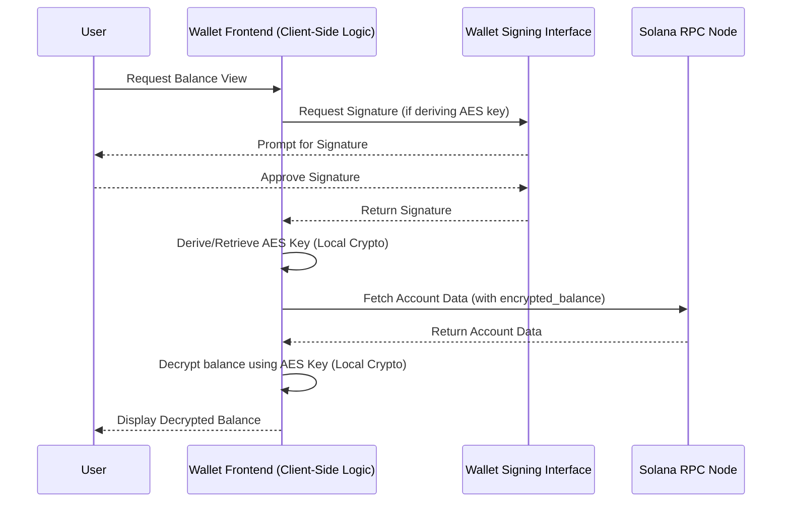
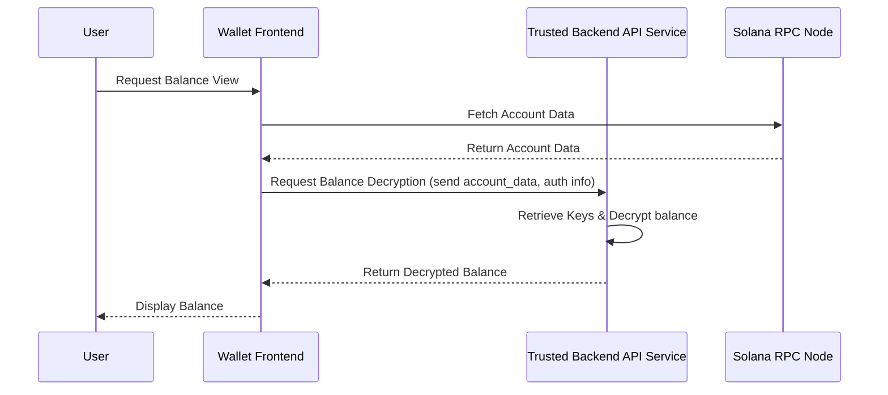

# Wallet Guide: Handling Confidential Balances

This guide covers how wallets can display user balances for Solana's Confidential Balances (SPL Token-2022 extension), focusing on key management and security models.

## Overview

Confidential Balances enhance privacy by encrypting token amounts on-chain using:

*   **ElGamal encryption:** Used for core transfer logic and securing balance amounts. Decryption requires the owner's ElGamal private key.
*   **AES encryption:** Often used to encrypt the *available balance* specifically for efficient viewing by the owner. Decryption requires a specific AES key.

The main challenge for wallets is securely managing the necessary ElGamal and AES keys to perform confidential operations and display the available balance.

## Encryption Key Management

Wallets need access to the correct ElGamal keypair and AES key associated with the confidential token account. There are primarily two approaches for managing these keys:

1.  **Derived Keys:** Both the ElGamal keypair and the AES key can be deterministically derived from the user's main wallet signature (e.g., signing predefined messages). This is convenient as it avoids managing separate keys; the user's main wallet key implicitly controls the derived encryption keys.
2.  **Separate Keys:** Unique ElGamal and/or AES keys could be generated and managed independently of the main wallet key. This requires separate mechanisms for storing, backing up, and retrieving these keys.

For standard non-custodial wallets, **deriving the encryption keys from the user's signature is the recommended approach** for simplicity and security.

## Secure Decryption: Client-Side (Non-Custodial Standard)

This section focuses specifically on decrypting the *available balance* (typically AES-encrypted) for display in a non-custodial wallet.

**Process:**

1.  Fetch the token account data (containing the encrypted available balance).
2.  Prompt the user to sign the predefined message (if using derived keys to get the AES key).
3.  **Locally derive/retrieve** the AES decryption key.
4.  **Locally decrypt** the available balance using the key.
5.  Format and display the result.

**Security:** Sensitive material (signature, derived/retrieved keys) **never leaves the client-side wallet environment.**

**Visualization (Client-Side Balance Decryption Flow):**

## Alternative: Trusted Backend Decryption

In scenarios where the user inherently trusts a backend service (e.g., custodial wallets, wallet-as-a-service platforms), decryption of the available balance can be delegated to the backend. This model assumes the backend securely manages the necessary keys (ElGamal and AES), whether derived or stored separately.

**Process:**

1.  The frontend fetches account data.
2.  The frontend requests the **trusted backend API** to decrypt the balance, potentially providing identifiers or authentication.
3.  The backend retrieves the necessary keys and performs decryption.
4.  The backend returns the decrypted balance to the frontend.

**Considerations:**

*   **Trust Assumption:** Relies entirely on the security and trustworthiness of the backend provider for key management and operations.
*   **Use Cases:** Suitable for custodial setups.
*   **ZK Proof Limitation:** This backend pattern might also appear temporarily in non-custodial contexts if client-side libraries for generating the complex Zero-Knowledge proofs required for *full confidential transfers* (using the ElGamal keys) are unavailable. However, even then, performing *balance decryption* (using the AES key) client-side is still preferred for non-custodial wallets if feasible.

**Visualization (Trusted Backend Balance Decryption Flow):**

## Conclusion

Handling Confidential Balances requires secure management of ElGamal and AES keys. Displaying the available balance involves decrypting it using the appropriate AES key. For non-custodial wallets, the standard secure method is **strictly client-side cryptography**, ideally deriving *all* necessary encryption keys from the user's signature locally. Backend decryption is viable only in **trusted environments** like custodial services. Robust client-side libraries for all cryptographic operations are essential for secure non-custodial Confidential Balance support.
