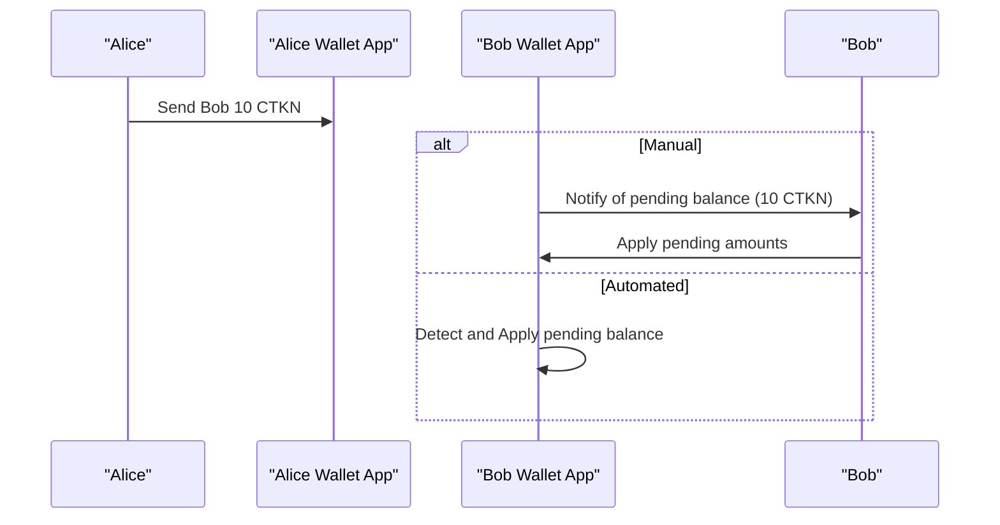
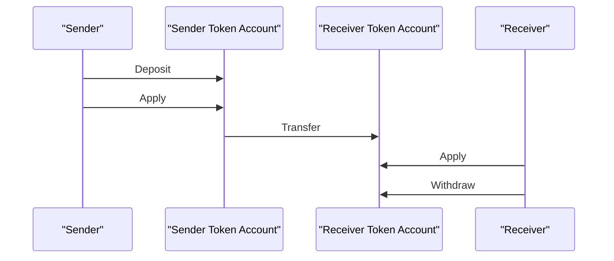
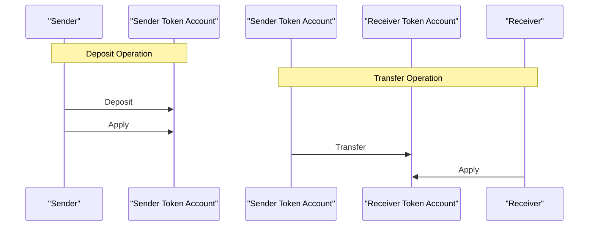
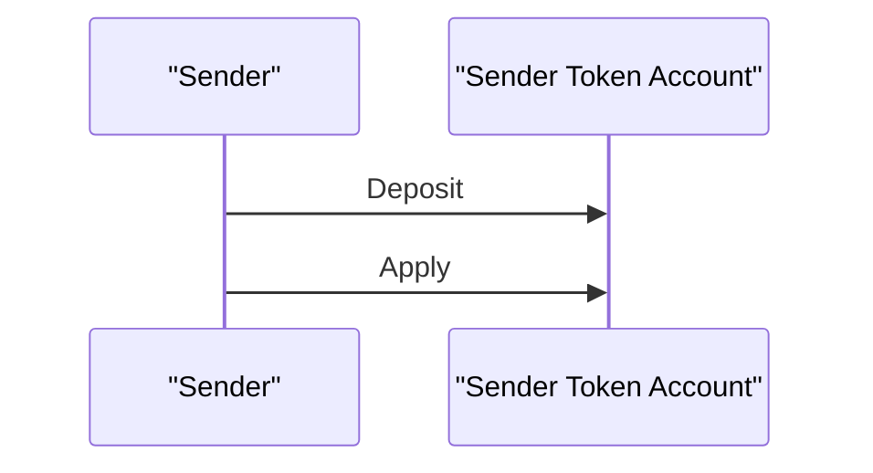
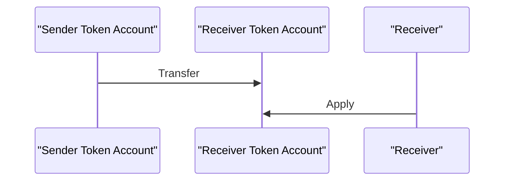
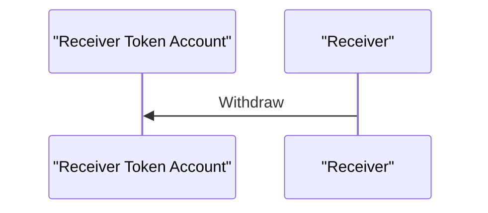

# Transfers

## Product Flows 
Flows assume Bob and Alice token accounts are already extended to support confidential transfers.  
For initializing token accounts, see [wallet setup](/docs/wallet_guide_setup.md).



- With one transaction signing prompt, Alice sends Bob 10 CTKN.
  - Frontend determines where to source sufficiently available funds from:
    - Public balance (requires Deposit operation)
    - Confidential balance
      - Available balance
      - Pending balance (requires Apply operation)
- Bob must independently apply pending amounts.
    - Wallet can prompt Bob with notifications.
    - Custodial wallets can automate Apply operation for Bob.
      - Only token account authority can sign an Apply operation.


## Main Interactions (without Confidential MintBurn)
A conceptual flow for an end-to-end confidential transfer, from a technical operations perspective.

These are illutrated high-level operations. Each operations can manifest as:
- Multiple instructions in one transaction.
- A sequential series of transactions.
- All of the above.

The following sections cover go into specifics for each operation, along with UX considerations.


### Apply

One single straightforward [instruction](../ingredients/apply_pending_balance/src/lib.rs#L85).  
Can be invoked at any time to flush pending balance into available (confidential) balance.  
For a responsive user experience, the [`Apply`](#apply) operation should immediately follow the [`Deposit`](#deposit) and [`Transfer`](#transfer) operations. This allows users to promptly see the effects of their actions.

### Deposit

One single straightforward [instruction](../ingredients/deposit_tokens/src/lib.rs#L23).  
It is compact enough to be included in a transaction with most other instructions.
A user usually deposits in anticipation of a transfer.  
From the end-user's perspective, [`Apply`](#apply) is typically the next operation so it should be implicitly automated:

Automated by instructions: 
 - Include both instructions in the same transaction.  

Automated by wallet: 
 - Prompt the end-user only once to sign two chronologically-ordered transactions.
 - Present both transaction signatures in a single UI element.

### Transfer

A complex process involving two user operations, with the first operation consisting of multiple instructions:
#### Transfer operation
1. Create a `range` zk proof account.
1. Create an `equality` zk proof account.
1. Create a `ciphertext validity` zk proof account.
1. Transfer (referencing above proofs).
1. Close the `range` zk proof account.
1. Close the `equality` zk proof account.
1. Close the `ciphertext validity` zk proof account.

This operation spans multiple transactions due to size limits, but should still be presented to the user as a single operation.  
Instruction order matters. See [Failing complex operations](#failing-complex-operations) & [Zk Proof location](#zk-proof-location-state-account-vs-instruction) for more details.

#### Apply operation
Unlike the [`Deposit`](#deposit) operation, where only the sender is involved, the [`Apply`](#apply) operation requires action from the receiver and cannot be automated. 

When a token account's pending balance is modified, it increases the pending balance queue. This queue can be monitored for changes. If an account has a `Pending Balance Credit Counter` greater than 0, the wallet UI can handle the notification in distinct ways:
- Non-custodial wallets: 
    - Prompt the end user with a predefined [`Apply`](#apply) transaction for signing.
- Custodial wallets (multiple options):
    - Same as above.
    - Automatically apply the pending balance on behalf of the user.

Here's a CLI example output for a receiver's token account immediately after the transfer operation.
```
$ spl-token display 8tKwnVasPLvVG7a9rdLV7rNs7B8zqwKgQGQb2qvYk9R1

SPL Token Account
  Address: 8tKwnVasPLvVG7a9rdLV7rNs7B8zqwKgQGQb2qvYk9R1
  Program: TokenzQdBNbLqP5VEhdkAS6EPFLC1PHnBqCXEpPxuEb
  Balance: 0
  Decimals: 2
  Mint: J1vRTq4TAXZsTniXFC9Kx2XgzaxrDMQRdnrB1QzjmAVk
  Owner: AY4RA4mKQvB7jcUHauo2cyp2pgv5ZPHc9aMsFEs9rBg3
  State: Initialized
  Delegation: (not set)
  Close authority: (not set)
Extensions:
  Immutable owner
  Confidential transfer:
    Approved: true
    Encryption key: FMLF1R4/cT1jMcrB9v3E6W33rW5J3JtfBwKU361T2y8=
    Pending Balance Low: DD50L2TA9Bf8jd+jlpYaux6NuTk/GGMapsHUwyAM13KkGN7rJF+tvq8oebjPkDWkfJPVCWHC4IpbVGrJFEg3EA==
    Pending Balance High: UOcgeT1vkxWkhm8znA86hJSNzdRAGkJOtJ9l0Xm8cjIOFFmPY0VsmI7im526rNjOnfSXfZwdY07SNILj0/XwHQ==
    Available Balance: AAAAAAAAAAAAAAAAAAAAAAAAAAAAAAAAAAAAAAAAAAAAAAAAAAAAAAAAAAAAAAAAAAAAAAAAAAAAAAAAAAAAAA==
    Decryptable Available Balance: zCjiI7gzoRGepXrzpvw02k3tapH4jy2wMza4TJkwsFWexRbn
    Confidential Credits: Enabled
    Non-Confidential Credits: Enabled
    Pending Balance Credit Counter: 1
    Maximum Pending Balance Credit Counter: 65536
    Expected Pending Balance Credit Counter: 0
    Actual Pending Balance Credit Counter: 0
```

### Withdraw

A complex operation requiring multiple instructions:

1. Create a `range` zk proof account.
1. Create an `equality` zk proof account.
1. Withdraw (referencing above proofs).
1. Close the `range` zk proof account.
1. Close the `equality` zk proof account.

Shares the same [`Transfer`](#transfer) operation complexities, without requiring [`Apply`](#apply).  
Once the withdraw instruction (#3) is confirmed, the token account balance is reflected in typical SPL fashion. 

## Main Interactions (with ConfidentialMintBurn)
The flow simplifies as Deposit and Withdraw become disabled.  
More to come. TBD.

## Trade-offs
While front end presentation for confidential balances can be consistent across Solana's ecosystem, there's no "right way" to execute operations.
When deciding on an approach compatible with your wallet project, here are some trade-offs to consider:

### Failing complex operations
For a technical illustration of operation complexity, refer to the [Basic Transfer Recipe](/docs/recipes.md#L24) diagram.

The execution of [`Transfer`](#transfer) and [`Withdraw`](#withdraw) transactions can fail for several reasons:
- Transaction becomes stale while awaiting confirmation.
  - Some transactions (like Range Proofs) are near transaction size limits. There's no room for priority fee instructions.
- A subset of transactions are malformed.
  - Confidential Balances have several dependencies, some with independent versioning cadence. Even minor dependency deviations may cause serialization or cryptographic errors.  
  Critical dependencies include:
    - Token2022 Program (on-chain Token Extension logic)
    - ElGamal Zk Program
    - [Client librares](/Cargo.toml)
- Developer error.
  - Incorrect instruction order.
  - Incorrect zk proof account initialization.

Since these operations progressively create new state, we need a way to reconcile the state in case of failure.  
There are two general strategies:

#### Atomic
Use an all-or-nothing approach with Jito Bundles. When the operation is at most five transactions, they can be bundled.
Bundles guarantee transaction order and atomicity. This approach has it's own trade-offs:
  - Landing the bundle on-chain is not guaranteed.
    - Failing one transaction fails the entire bundle.
    - Retrying a bundle requires re-signing all bundled transactions, preventing blockhash expiration.
  - Jito Bundles are only supported by a subset of Solana validators, potentially delaying bundle confirmation.

See an example of [atomic transfer in the recipes](/recipes/src/lib.rs#L90).

#### Non-Atomic
Foregoing atomicity allows for more flexible transaction handling, but requires additional logic to handle failures.
The general approach is to track operation progress within the wallet, always knowing which transactions have been executed so far. This 
Upon transaction failure, there are two recourses:

*Abort (roll-back):*  
- Sender must issue net-new transactions to sign for state account closures.
- Requires keeping hold of allocated state account keypairs (typically ephemeral as not needed after closing).

*Recover (roll-forward):*  
- Retry the operation from the point of failure.
    - Only succeeds if the transaction in indeed structurally sound (no execution errors).
    - Blockhashes may expire during retrys, requiring transaction re-signing (same as atomic approach).

Leaving the operation stale leaves SOL on the table, as closing accounts recovers an account's existential deposit (rent).
    

### Zk Proof location: State Account vs Instruction
Context state accounts are the most reliable approach for Confidential Balances because they can accomodate more zk proof data (max 10MB).  
However, small-enough proofs can be included within the transaction instruction - eliminating the need for a state account.

If you're looking to reduce the total number of transactions, consider .including proofs within the transaction instruction.  
See an [example when extending the sender/receiver token accounts for confidential transfers](/ingredients/setup_token_account/src/lib.rs#L72-L77).