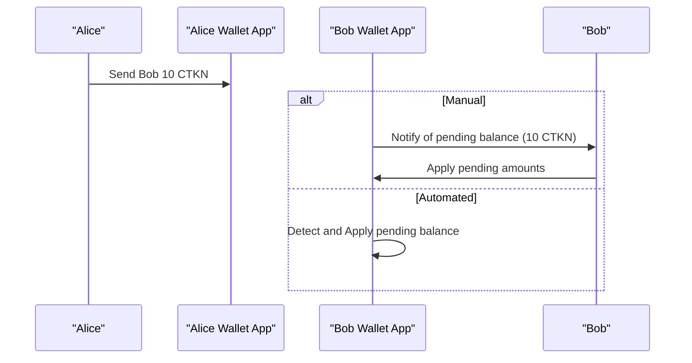
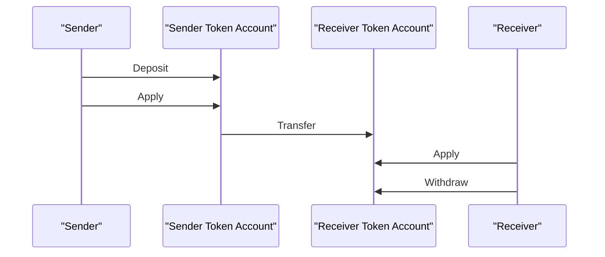
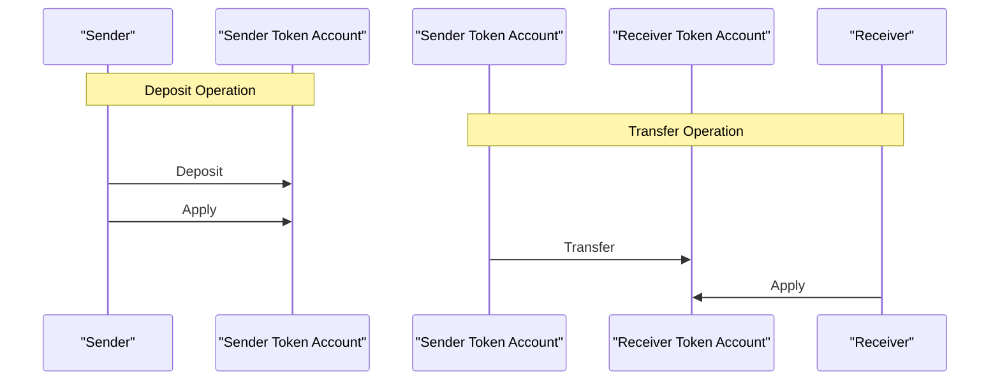
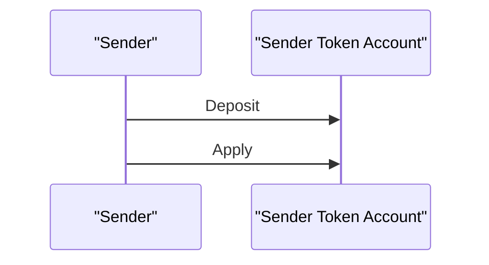
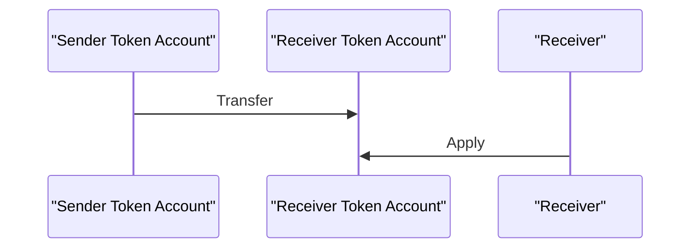
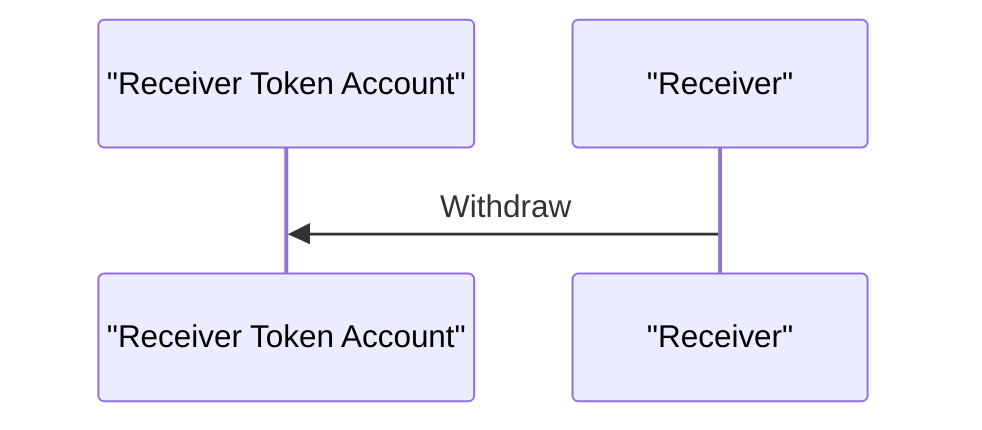

# Transfers

## Product Flows 
These flows assume that Bob and Alice's token accounts are already set up to support confidential transfers. For instructions on initializing token accounts, refer to the [wallet setup guide](/docs/wallet_guide_setup.md).



- Alice sends Bob 10 CTKN with a single transaction signing prompt.
  - The frontend determines the source of funds:
    - Public balance (requires a [Deposit](#deposit) operation)
    - Confidential balance
      - Available balance
      - Pending balance (requires an [Apply](#apply) operation)
- Bob must apply pending amounts independently.
  - The wallet can notify Bob of pending amounts.
  - Custodial wallets can automate the [Apply](#apply) operation for Bob.
    - Only the token account authority can sign an [Apply](#apply) operation.

## Main Interactions (without Confidential MintBurn)
This section outlines a conceptual flow for an end-to-end confidential transfer from a technical operations perspective.



These are high-level operations that can manifest as:
- Multiple instructions in a single transaction.
- A sequential series of transactions.
- A combination of both.

The following sections provide specifics for each operation, along with UX considerations.

### Apply


The [Apply](#apply) operation is a straightforward [instruction](../ingredients/apply_pending_balance/src/lib.rs#L85) that can be invoked at any time to convert pending balance into available (confidential) balance. For a responsive user experience, the [Apply](#apply) operation should immediately follow the [Deposit](#deposit) and [Transfer](#transfer) operations, allowing users to promptly see the effects of their actions.

### Deposit


The [Deposit](#deposit) operation is a straightforward [instruction](../ingredients/deposit_tokens/src/lib.rs#L23) that is compact enough to be included in a transaction with most other instructions. Users typically deposit in anticipation of a transfer. From the end-user's perspective, the [Apply](#apply) operation is typically the next step and should be implicitly automated:

Automated by instructions:
- Include both instructions in the same transaction.

Automated by wallet:
- Prompt the end-user only once to sign two chronologically-ordered transactions.
- Present both transaction signatures in a single UI element.

### Transfer


The [Transfer](#transfer) operation is complex, involving two user operations. The first operation consists of multiple instructions:

#### Transfer operation
1. Create a `range` zk proof account.
2. Create an `equality` zk proof account.
3. Create a `ciphertext validity` zk proof account.
4. Transfer (referencing the above proofs).
5. Close the `range` zk proof account.
6. Close the `equality` zk proof account.
7. Close the `ciphertext validity` zk proof account.

This operation spans multiple transactions due to size limits but should be presented to the user as a single operation. Instruction order is crucial. See [Failing complex operations](#failing-complex-operations) & [Zk Proof location](#zk-proof-location-state-account-vs-instruction) for more details.

#### Apply operation
Unlike the [Deposit](#deposit) operation, where only the sender is involved, the [Apply](#apply) operation requires action from the receiver and cannot be automated.

When a token account's pending balance is modified, it increases the pending balance queue. This queue can be monitored for changes. If an account has a `Pending Balance Credit Counter` greater than 0, the wallet UI can handle the notification in distinct ways:
- Non-custodial wallets:
  - Prompt the end user with a predefined [Apply](#apply) transaction for signing.
- Custodial wallets (multiple options):
  - Same as above.
  - Automatically apply the pending balance on behalf of the user.

Here's a CLI example output for a receiver's token account immediately after the [Transfer](#transfer) operation.

```
$ spl-token display 8tKwnVasPLvVG7a9rdLV7rNs7B8zqwKgQGQb2qvYk9R1

SPL Token Account
  Address: 8tKwnVasPLvVG7a9rdLV7rNs7B8zqwKgQGQb2qvYk9R1
  Program: TokenzQdBNbLqP5VEhdkAS6EPFLC1PHnBqCXEpPxuEb
  Balance: 0
  Decimals: 2
  Mint: J1vRTq4TAXZsTniXFC9Kx2XgzaxrDMQRdnrB1QzjmAVk
  Owner: AY4RA4mKQvB7jcUHauo2cyp2pgv5ZPHc9aMsFEs9rBg3
  State: Initialized
  Delegation: (not set)
  Close authority: (not set)
Extensions:
  Immutable owner
  Confidential transfer:
    Approved: true
    Encryption key: FMLF1R4/cT1jMcrB9v3E6W33rW5J3JtfBwKU361T2y8=
    Pending Balance Low: DD50L2TA9Bf8jd+jlpYaux6NuTk/GGMapsHUwyAM13KkGN7rJF+tvq8oebjPkDWkfJPVCWHC4IpbVGrJFEg3EA==
    Pending Balance High: UOcgeT1vkxWkhm8znA86hJSNzdRAGkJOtJ9l0Xm8cjIOFFmPY0VsmI7im526rNjOnfSXfZwdY07SNILj0/XwHQ==
    Available Balance: AAAAAAAAAAAAAAAAAAAAAAAAAAAAAAAAAAAAAAAAAAAAAAAAAAAAAAAAAAAAAAAAAAAAAAAAAAAAAAAAAAAAAA==
    Decryptable Available Balance: zCjiI7gzoRGepXrzpvw02k3tapH4jy2wMza4TJkwsFWexRbn
    Confidential Credits: Enabled
    Non-Confidential Credits: Enabled
    Pending Balance Credit Counter: 1
    Maximum Pending Balance Credit Counter: 65536
    Expected Pending Balance Credit Counter: 0
    Actual Pending Balance Credit Counter: 0
```

### Withdraw


The [Withdraw](#withdraw) operation is complex, requiring multiple instructions:

1. Create a `range` zk proof account.
2. Create an `equality` zk proof account.
3. Withdraw (referencing the above proofs).
4. Close the `range` zk proof account.
5. Close the `equality` zk proof account.

This operation shares the same complexities as the [Transfer](#transfer) operation but does not require an [Apply](#apply) operation. Once the withdraw instruction (#3) is confirmed, the token account balance is reflected in typical SPL fashion.

## Main Interactions (with Confidential MintBurn)
The flow simplifies as [Deposit](#deposit) and [Withdraw](#withdraw) become disabled. More details will be provided soon.

## Trade-offs
While the frontend presentation for confidential balances can be consistent across Solana's ecosystem, there's no "right way" to execute operations. When deciding on an approach compatible with your wallet project, here are some trade-offs to consider:

### Failing complex operations
For a technical illustration of operation complexity, refer to the [Basic Transfer Recipe](/docs/recipes.md#L24) diagram.

The execution of [Transfer](#transfer) and [Withdraw](#withdraw) transactions can fail for several reasons:
- Transaction becomes stale while awaiting confirmation.
  - Some transactions (like Range Proofs) are near transaction size limits. There's no room for priority fee instructions.
- A subset of transactions are malformed.
  - Confidential Balances have several dependencies, some with independent versioning cadence. Even minor dependency deviations may cause serialization or cryptographic errors.  
  Critical dependencies include:
    - Token2022 Program (on-chain Token Extension logic)
    - ElGamal Zk Program
    - [Client libraries](/Cargo.toml)
- Developer error.
  - Incorrect instruction order.
  - Incorrect zk proof account initialization.

Since these operations progressively create new state, we need a way to reconcile the state in case of failure. There are two general strategies:

#### Atomic
Use an all-or-nothing approach with Jito Bundles. When the operation is at most five transactions, they can be bundled. Bundles guarantee transaction order and atomicity. This approach has its own trade-offs:
  - Landing the bundle on-chain is not guaranteed.
    - Failing one transaction fails the entire bundle.
    - Retrying a bundle requires re-signing all bundled transactions, preventing blockhash expiration.
  - Jito Bundles are only supported by a subset of Solana validators, potentially delaying bundle confirmation.

See an example of [atomic transfer in the recipes](/recipes/src/lib.rs#L90).

#### Non-Atomic
Foregoing atomicity allows for more flexible transaction handling but requires additional logic to handle failures. The general approach is to track operation progress within the wallet, always knowing which transactions have been executed so far. Upon transaction failure, there are two recourses:

*Abort (roll-back):*  
- The sender must issue new transactions to sign for state account closures.
- Requires keeping hold of allocated state account keypairs (typically ephemeral as not needed after closing).

*Recover (roll-forward):*  
- Retry the operation from the point of failure.
    - Only succeeds if the transaction is indeed structurally sound (no execution errors).
    - Blockhashes may expire during retries, requiring transaction re-signing (same as atomic approach).

Leaving the operation stale leaves SOL on the table, as closing accounts recovers an account's existential deposit (rent).

### Zk Proof location: State Account vs Instruction
Context state accounts are the most reliable approach for Confidential Balances because they can accommodate more zk proof data (max 10MB). However, small-enough proofs can be included within the transaction instruction itself, eliminating the need for a state account.

If you're looking to reduce the total number of transactions, consider including proofs within the transaction instruction. See an [example when extending the sender/receiver token accounts for confidential transfers](/ingredients/setup_token_account/src/lib.rs#L72-L77).

